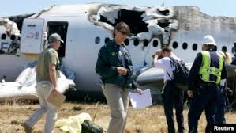

# Civil Aviation Risk Analysisn - First Project
## Civil aviation accidents

--- 

Auther : [Vilmarson JULES](vilmarsonjules22@gmail.com)

### Overview
---
This project is intended to analyze aviation risk accident from the National Transportation Safety Board [(NTSB)](https://www.kaggle.com/datasets/khsamaha/aviation-accident-database-synopses) from **(19962 to 2023)**.

Then,this project is intended to :

1. Identify the lowest-risk aircraft for commercial and private enterprises.
2. Aims to surface actionable insights for business stakeholders
3. Identifying trends in accident severity, injury rates, flight phases, and aircraft models.

## Business problem

---

Many companies are exploring entry into the aviation industry — both in commercial and private operations. However, aviation is a high-stakes sector with substantial operational and safety risks. One key concern is identifying which types of aircraft pose the least safety risk, especially given the potential financial and human costs of accidents.

Currently, company leadership lacks the data-driven insight necessary to make informed decisions about which aircraft types are safest, most reliable, or most suited to their operational goals. My task is to bridge that gap using historical accident and incident data to uncover meaningful patterns and provide a clear, evidence-backed view of aviation risks.

## Data

The dataset used in this project comes from the National Transportation Safety Board [(NTSB)](https://www.kaggle.com/datasets/khsamaha/aviation-accident-database-synopses) and contains records of civil aviation accidents and selected incidents in the United States and international waters from 1962 to 2023. It includes detailed information on accident causes, aircraft types, locations, and severity.

This rich dataset provides a solid foundation for analyzing aviation safety trends and evaluating risk factors relevant to investment decisions. During the project, data cleaning, handling of missing values, and aggregation were performed to prepare the data for effective analysis and visualization.

## Methods

To realize this project, the use of technical tools environnement like **Git, GitHUb, Git Bash, Jupyter Notebook** was a most. Moreover great features of *Python language* are used with a main focus on `Pandas and Matplotlib ` Packages.

Throughout this project, we leverages : 
- Descriptive statistics analysis, instead of inferential Satistics, to  achieve analysis
- Data cleaning, exploratory analysis using great features of `Pandas`
- Data Visualization, and interactive dashboard with power Bi to extract salients insight for business stakeholders

## Results
---
**The analysis of aviation accident data from 1962 to 2023 revealed key insights for assessing investment risks in the aviation sector:**

1. General Aviation Risk: Cessna and Piper dominate accident counts due to widespread use, emphasizing the need to assess accident severity and context, not just frequency.

2. Geographical Risks: High accident rates in states like California, Texas, Florida, and Alaska highlight the influence of weather and terrain on safety.

3. Severity vs. Frequency: Larger aircraft (e.g., Boeing) have fewer accidents but higher fatality rates, requiring balanced risk evaluation.

4. Weather Effects: Clear weather sees more accidents overall, but poor weather conditions result in more severe incidents, impacting investment decisions.

ok

