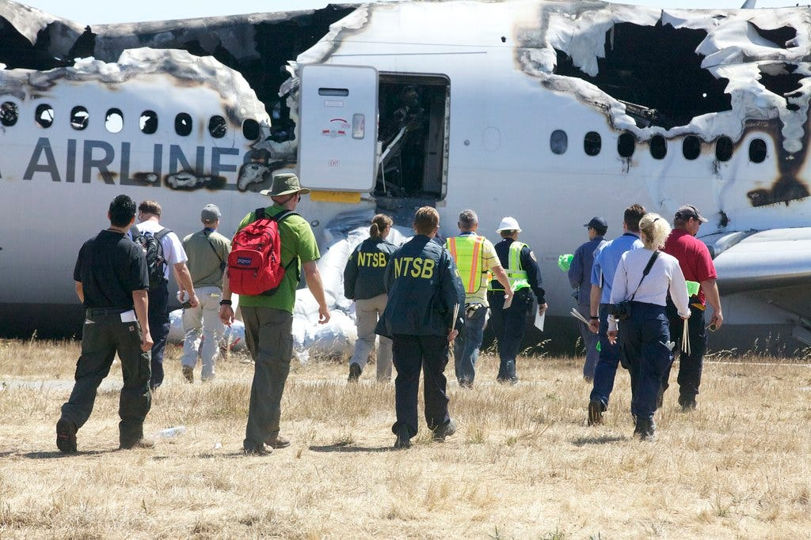
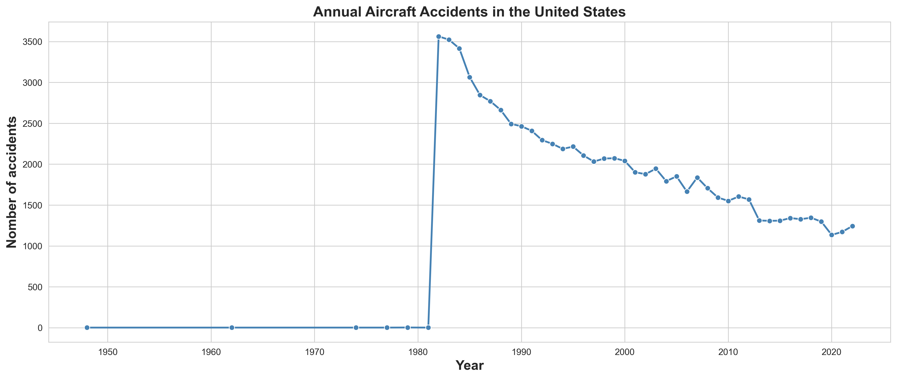
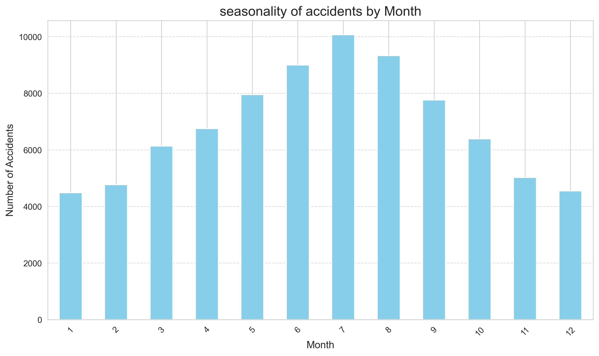
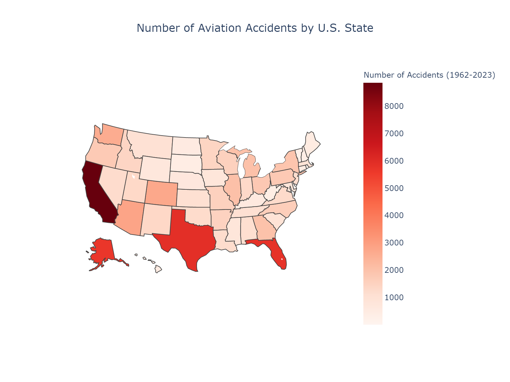
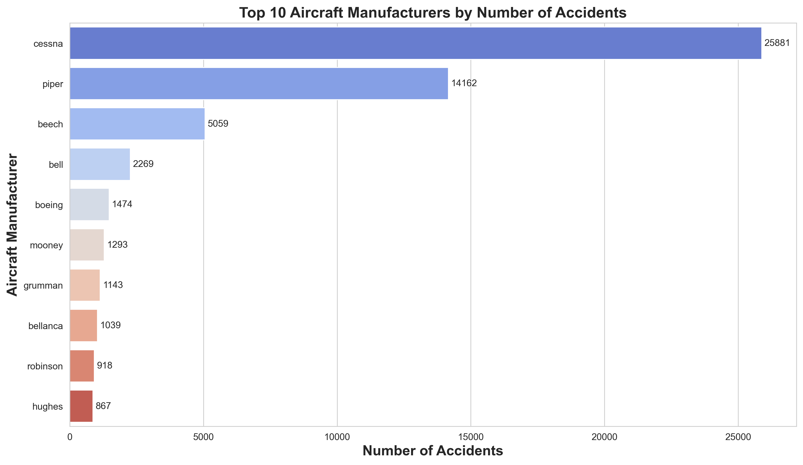
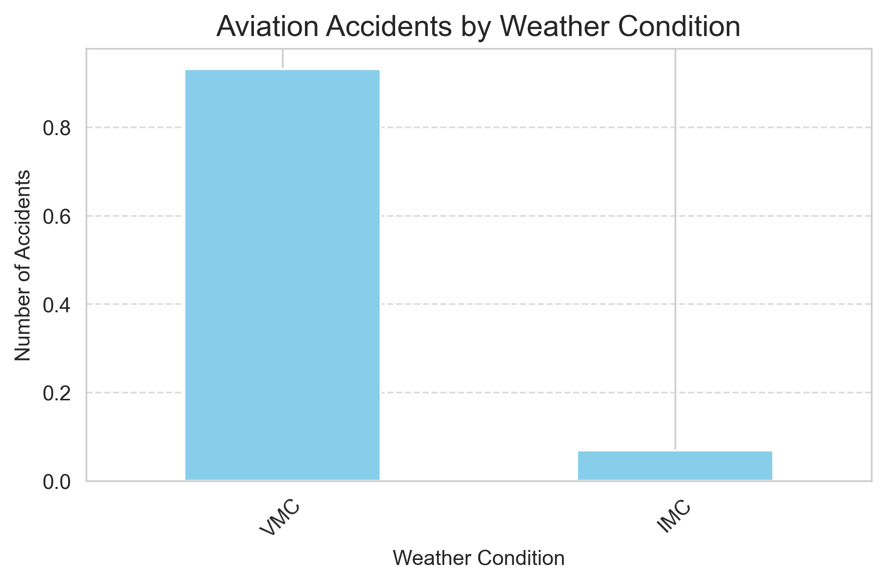
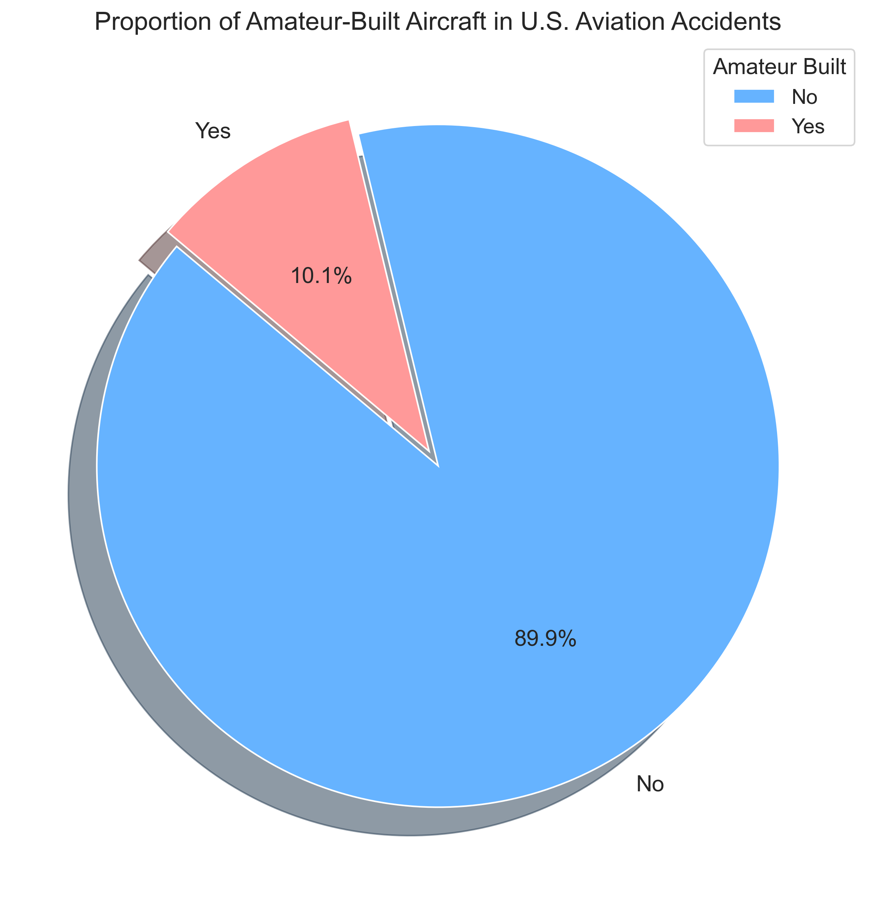
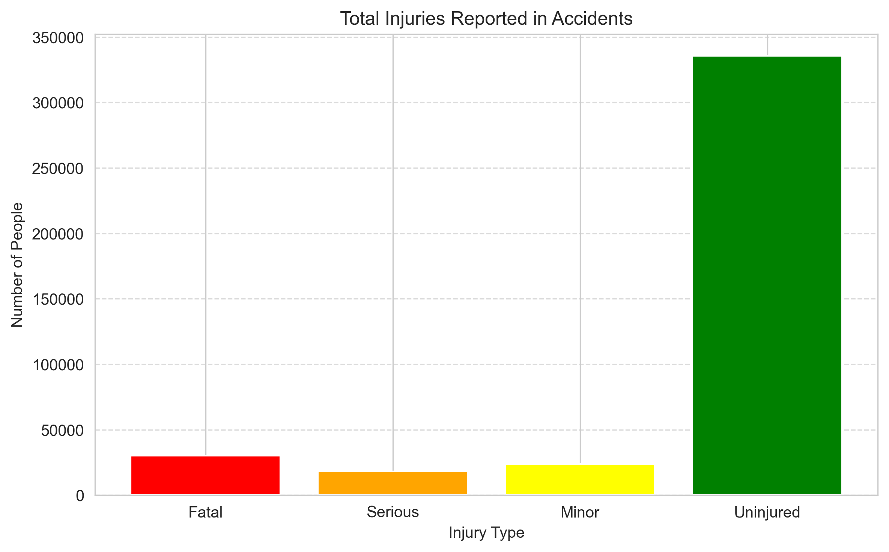

# Civil Aviation Risk Analysis - First Project
## Civil aviation accidents

--- 


**Author:** [Vilmarson JULES](mailto:vilmarsonjules22@gmail.com)

### Overview
---
This project is intended to analyze aviation risk accident from the National Transportation Safety Board [(NTSB)](https://www.kaggle.com/datasets/khsamaha/aviation-accident-database-synopses) from **(1962 to 2023)**.

Then,this project is intended to :

1. Identify the lowest-risk aircraft for commercial and private enterprises.
2. Aims to surface actionable insights for business stakeholders
3. Identifying trends in accident severity, injury rates, flight phases, and aircraft models.

## Business problem

---


Many companies are exploring entry into the aviation industry — both in commercial and private operations. However, aviation is a high-stakes sector with substantial operational and safety risks. One key concern is identifying which types of aircraft pose the least safety risk, especially given the potential financial and human costs of accidents.

Currently, company leadership lacks the data-driven insight necessary to make informed decisions about which aircraft types are safest, most reliable, or most suited to their operational goals. My task is to bridge that gap using historical accident and incident data to uncover meaningful patterns and provide a clear, evidence-backed view of aviation risks.

## Data

The dataset used in this project comes from the National Transportation Safety Board [(NTSB)](https://www.kaggle.com/datasets/khsamaha/aviation-accident-database-synopses) and contains records of civil aviation accidents and selected incidents in the United States and international waters from 1962 to 2023. It includes detailed information on accident causes, aircraft types, locations, and severity.

This rich dataset provides a solid foundation for analyzing aviation safety trends and evaluating risk factors relevant to investment decisions. During the project, data cleaning, handling of missing values, and aggregation were performed to prepare the data for effective analysis and visualization.


## Methods

----
To realize this project, the use of technical tools environnement like **Git, GitHUb, Git Bash, Jupyter Notebook** was a most. Moreover great features of *Python language* are used with a main focus on `Pandas and Matplotlib ` Packages.

Throughout this project, we leverages : 
- Descriptive statistics analysis, instead of inferential Satistics, to  achieve analysis
- Data cleaning, exploratory analysis using great features of `Pandas`
- Data Visualization, and interactive dashboard with power Bi to extract salients insight for business stakeholders

## Results
---

**The analysis of aviation accident data from 1962 to 2023 revealed key insights for assessing investment risks in the aviation sector:**

1. General Aviation Risk: Cessna and Piper dominate accident counts due to widespread use, emphasizing the need to assess accident severity and context, not just frequency.

2. Geographical Risks: High accident rates in states like California, Texas, Florida, and Alaska highlight the influence of weather and terrain on safety.

3. Severity vs. Frequency: Larger aircraft (e.g., Boeing) have fewer accidents but higher fatality rates, requiring balanced risk evaluation.

4. Weather Effects: Clear weather sees more accidents overall, but poor weather conditions result in more severe incidents, impacting investment decisions.



The number of reported accidents increased significantly from the 1960s through the early 1980s.  
A peak appears around the early **1980s**, likely reflecting increased aviation activity during that period.

From the 1990s onward, there's a steady decline in accidents, possibly due to:
- Advancements in aircraft technology,
- Stricter safety regulations, and so on.




**July, August and september** tend to have the highest number of accidents,   
likely due to increased flight activity during the summer travel season, including more private and recreational flights.

Whereas **January and February** generally show fewer incidents,  
possibly due to reduced flight volume in winter or stricter weather-related cancellations.

California has the highest number of accidents, followed by Texas and Florida.
Reflecting their large populations and heavy air traffic. Alaska ranks surprisingly high due to its challenging flying conditions.
Smaller states generally show fewer accidents, consistent with lower aviation activity.

 

##### California has the highest number of accidents, followed by Texas and Florida.   
Reflecting their large populations and heavy air traffic. Alaska ranks surprisingly high due to its challenging flying conditions.  
Smaller states generally show fewer accidents, consistent with lower aviation activity.




#### As we see above, that certain manufacturers appear far more frequently in accident reports.

This may reflect their dominance in the market rather than poor safety records.
For example, if manufacturers like **Cessna or Piper lead** in accident counts, it's likely due to their widespread use in general aviation. Then, what I can say to stakholders so far is : Investors should interpret and understand this data cautiously, high accident counts may indicate high exposure,
that's mean :
- More aircraft in operation
- Not necessarily higher risk per aircraft.
Howerver, While **Cessna** appears frequently in accident reports, it has a relatively low fatality rate per accident.  
In contrast, **Boeing** , though involved in fewer accidents overall, shows the highest average fatalities,  
which likely reflects the higher passenger capacity of Boeing aircraft.




- **Visual Meteorological Conditions (VMC)** accounted for **93.16%** of all recorded accidents.
- **Instrument Meteorological Conditions (IMC)** were involved in only **6.84%** of cases.

This strong imbalance suggests that most accidents occur during clear weather, likely due to higher flight frequency under VMC. However, IMC-related accidents, though fewer, may involve **higher risk and severity**, given the challenges of flying in poor visibility and adverse weather conditions.



only a small proportion 10.1 % of aircraft involved in accidents were amateur-built,
while over 89.9 % were professionally manufactured.
This is consistent with market share, as most flights are conducted by certified aircraft.
However, the presence of amateur-built aircraft in accident records still represents a notable risk factor, especially in the private and recreational aviation sector, and warrants careful oversight by insurers and regulators.



he largest category, Uninjured , shows the number of passengers or crew who escaped harm despite involvement in an accident, underscoring that not all incidents result in physical harm. The Fatal injuries count, represented in red, highlights the most critical outcome, though it is the smallest group relative to other injury types.


## Conclusion

---

This analysis highlights key insights essential for investors evaluating risk in the aviation sector. While manufacturers like **Cessna and Piper** show high accident counts, this primarily reflects their extensive use rather than inherently greater risk per aircraft. Investors must interpret accident data within the context of **market exposure and operational scale** to avoid misleading conclusions.

Geographic factors play a critical role, with states such as **California, Texas, Florida, and Alaska** exhibiting higher accident rates due to diverse challenges like terrain, weather, and traffic density. Incorporating these **regional risk profiles** allows investors to better estimate potential losses and identify opportunities for targeted mitigation.

Furthermore, focusing on both **accident frequency and severity** is crucial. Larger commercial aircraft like those from Boeing may have fewer accidents, but the higher fatality rates per incident indicate significant financial and reputational risks. Lastly, the impact of weather cannot be overlooked—while most accidents occur in clear conditions, those under adverse weather (IMC) tend to be more severe, emphasizing the need for investments in technology and training to reduce exposure.

In summary, a **multidimensional, data-driven approach** that balances manufacturer exposure, geographic risks, accident severity, and weather variability provides the best framework for investors. This approach not only mitigates potential losses but also uncovers strategic opportunities for sustainable growth in aviation.


## Next Steps

---

To build on the insights of this analysis and support informed investment decisions in the aviation industry, the following steps are recommended:

- **Deepen Geographic Analysis**  
  Conduct more granular, region-specific studies that incorporate factors like terrain, seasonal weather patterns, and airport density to refine geographic risk assessments.

- **Integrate Economic Impact Modeling**  
  Evaluate the financial consequences of different accident scenarios using cost-benefit models. This can help quantify potential returns and losses across aircraft types and operational contexts.

- **Incorporate Real-Time and Predictive Data**  
  Use real-time aviation safety data and predictive analytics to monitor emerging risks, allowing investors to adapt strategies proactively.

- **Engage with Industry Stakeholders**  
  Collaborate with aviation regulators, insurers, and safety experts to validate findings and align investment decisions with current safety improvements and regulatory changes.

- **Expand to International Comparisons**  
  Compare accident patterns and risk factors across countries to identify best practices and explore diversification opportunities in global aviation markets.

These next steps will enhance the precision of your risk evaluation framework and provide investors with a robust foundation for strategic, data-driven decisions in a high-stakes industry.

## Explore the Full Analysis & Contact

---

Delve into the complete analytical workflow in the [Jupyter Notebook](./civil_aviation_risk_analysis.ipynb) or consult the accompanying [presentation](./civil_aviation_risk_presentation.pdf) slides for a high-level summary of key findings and recommendations.

For professional inquiries, collaborations, or deeper discussions about the methodology and implications, feel free to reach out to Vilmarson JULES at [vilmarsonjules22@gmail.com](vilmarsonjules22@gmail.com)


## Repository Structure

```

├── Data
├── Images
├── README.md
├── civil_aviation_risk_presentation.pdf
└── civil_aviation_risk_analysis.ipynb
```


